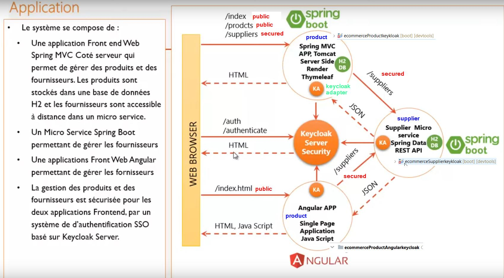

# keycloak 

https://blog.ineat-group.com/2017/12/securisez-vos-apis-spring-avec-keycloak-3-utilisation-des-connecteurs-spring-de-keycloak/   
https://medium.com/@zineb.errahmouni/s%C3%A9curiser-une-application-spring-boot-angular-avec-keycloak-part-1-25fef0783c5d   
https://github.com/czetsuya/Keycloak-Angular-Auth  

## introduction
**Gestion des identités**  : Consiste à l'identité des utilisateurs avec ces information propres dans la base de données de keyclock.   
**Authentifcation** : Prouver que l'utilissateur est bien l'utilisateur qui prétent etre.   
**Autorisation** : Notion de role, de group.  

 

 


### Adaptateurs
**Keycloak** propose des **adaptateurs** pour chaque composant ou framework. On peut integrer keyclock avec spring securité.

Les parametres de configuration dans le fichier de configuration **keycloack.json** peuvent directement ajouter à spring via le fichier **application.properties**  
 


### Oauth2
Keycloak est basé sur le protocole **open Connect** qui lui meme est basé sur **Oauth2**.   

Oauth2 est un protocole de deleguation d'authorisation uniquement. Il ne gere pas l'identité. Il s'appuye sur un simple tocken 
### openID connect 
openID connect est un protocole au dessus de l'Oauth2. Contrairment à l'Oauth2 , il s'appuye sur un JWT.

#### openID connect
 

#### jwt
 


## keykloak

fichier de configuration
Keycloak sur \standalone\configuration\standalone.xml
<socket-binding name=”http” port=”${jboss.http.port:8080}”/>


Uitlise H2 persistent par défaut mais on peut changer la configration par mysql 
````shell script
C:\PERSONNEL\keykloak\keycloak-8.0.2\bin
λ .\standalone.sh -b 0.0.0.0
````
http://localhost:8080/auth/

Par defaut keykloak créé autoamtiquement un **real** appelé **master**. Il n'est pas préconisé celui mais plutot en créé polus significatique.


 
 default domain
 
 

creation d'un domain (realm) **ecommerce** avec un client (application) **product-app**. Qui sera le **client-id**

 

 
 
 ## Application
 
  
 
  
 
  

 ## microservice PRODUCT
Exposition de **/products** ( local) et **/suppliers** herbergé sur le microservice distant **SUPPLIER** en tant que **controller**. Lorsque un utilisatueur demandes les resources **/supplier** via le microservice **PRODUCT** , il y automatiquement génération d'un token par keycloak qui est ensuite encapsuler dans le header de la requete emise depuis le microservice **PRODUCT** vers le microservice **SUPPLIER**. On utilise la methode **KeycloakRestTemplate** pour interrogé la ressource distante via une requete contenant implicitement le JWT.


 

 


## MicroService SUPPLIER
Le microservice **products** communique avec ce microservice **supplier**. L'authentification ici est de type backend to backend.

le microservice **supplier** via **bear only**

 

 

 

 

 

 


## frontend Angular
````shell script
λ npm install bootstrap jquery popper keycloak-js --save
../..
+ jquery@3.5.0
+ bootstrap@4.4.1
+ popper@1.0.1
+ keycloak-js@10.0.0
````

Creation d'un service
````shell script
ng g s services/keycloak-security
````


 


